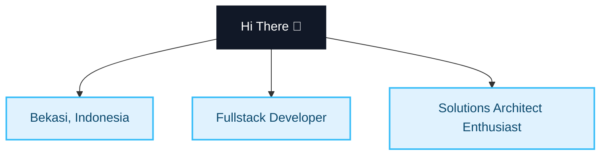
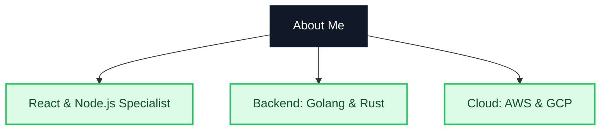
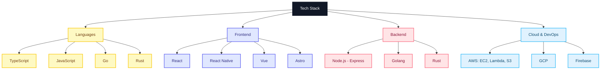
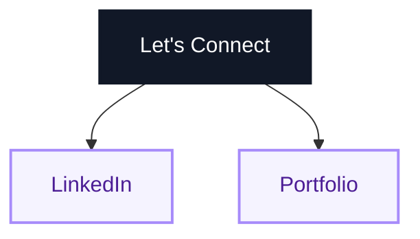

---

## 👋 Profile Overview (Styled)

```mermaid
flowchart TD
    A[Hi There 👋]
    B[Bekasi, Indonesia]
    C[Fullstack Developer]
    D[Solutions Architect Enthusiast]

    A --> B
    A --> C
    A --> D

    classDef header fill:#111827,color:#ffffff,stroke:#111827,stroke-width:2px;
    classDef info fill:#E0F2FE,color:#0C4A6E,stroke:#38BDF8,stroke-width:2px;

    class A header;
    class B,C,D info;
```

---

## 🚀 About Me (Styled)

```mermaid
flowchart TD
    A[About Me]
    B[React & Node.js Specialist]
    C[Backend: Golang & Rust]
    D[Cloud: AWS & GCP]

    A --> B
    A --> C
    A --> D

    classDef header fill:#111827,color:#ffffff,stroke:#111827,stroke-width:2px;
    classDef about fill:#DCFCE7,color:#14532D,stroke:#22C55E,stroke-width:2px;

    class A header;
    class B,C,D about;
```

---

## 💻 Tech Stack (Styled)

```mermaid
flowchart TD
    A[Tech Stack]

    B[Languages]
    C[Frontend]
    D[Backend]
    E[Cloud & DevOps]

    A --> B
    A --> C
    A --> D
    A --> E

    B --> B1[TypeScript]
    B --> B2[JavaScript]
    B --> B3[Go]
    B --> B4[Rust]

    C --> C1[React]
    C --> C2[React Native]
    C --> C3[Vue]
    C --> C4[Astro]

    D --> D1[Node.js - Express]
    D --> D2[Golang]
    D --> D3[Rust]

    E --> E1[AWS: EC2, Lambda, S3]
    E --> E2[GCP]
    E --> E3[Firebase]

    classDef header fill:#111827,color:#ffffff,stroke:#111827,stroke-width:2px;

    classDef catLang fill:#FEF9C3,color:#713F12,stroke:#FACC15,stroke-width:2px;
    classDef catFront fill:#E0E7FF,color:#312E81,stroke:#6366F1,stroke-width:2px;
    classDef catBack fill:#FFE4E6,color:#881337,stroke:#FB7185,stroke-width:2px;
    classDef catCloud fill:#E0F2FE,color:#0C4A6E,stroke:#38BDF8,stroke-width:2px;

    class A header;

    class B,B1,B2,B3,B4 catLang;
    class C,C1,C2,C3,C4 catFront;
    class D,D1,D2,D3 catBack;
    class E,E1,E2,E3 catCloud;
```

---

## 🤝 Let's Connect (Styled)

```mermaid
flowchart TD
    A[Let's Connect]
    B[LinkedIn]
    C[Portfolio]

    A --> B
    A --> C

    classDef header fill:#111827,color:#ffffff,stroke:#111827,stroke-width:2px;
    classDef link fill:#F5F3FF,color:#4C1D95,stroke:#A78BFA,stroke-width:2px;

    class A header;
    class B,C link;
```

---
