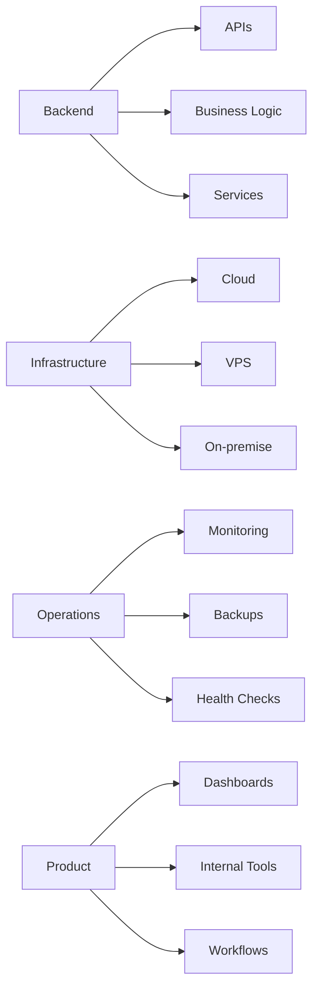

<h1 align="center">Hi, I'm Dzaky 👋</h1>

<p align="center">
  Backend · Infrastructure · Fullstack
</p>

<p align="center">
  Jakarta Metropolitan Area, Indonesia
</p>

<p align="center">
  <a href="mailto:dzakyalr@gmail.com">Email</a> ·
  <a href="https://dzaky.dev">Portfolio</a> ·
  <a href="https://www.linkedin.com/in/dzakyalr">LinkedIn</a>
</p>


## About

I build backend systems, internal platforms, and production infrastructure for real-world business operations.

Mostly working with **TypeScript, Go, Node.js, PostgreSQL, Docker, Linux, GitHub Actions, cloud, VPS, and on-premise environments**.

I like practical engineering: clean APIs, reliable deployments, observability, backups, infrastructure that is simple enough to maintain, and systems that actually fit the business context.

---

## Focus

- Backend systems and service design
- Internal platforms and operational tools
- Production deployment workflows
- Cloud, VPS, and on-premise infrastructure
- Monitoring, health checks, logs, and backups
- Cost-aware architecture and practical reliability

---


## Things I Work On




## Connect

* Email: [dzakyalr@gmail.com](mailto:dzakyalr@gmail.com)x
* Portfolio: [Portfolio](https://dzaky.dev)
* LinkedIn: [LinkedIn](https://www.linkedin.com/in/dzakyalr)

```
```
